# SpendSnap

> Log spending quickly, review it confidently, and see personal or shared budgets update in real time.

SpendSnap helps people record purchases before they forget, correct past entries, understand spending patterns, and receive warnings at budget percentages they choose. Expenses can remain personal or be shared with selected groups such as households and trips.


---

## Table of Contents

1. [Overview](#1-overview)
2. [Problem Motivation](#2-problem-motivation)
3. [Features](#3-features)
4. [Screenshots / Demo](#4-screenshots--demo)
5. [Tech Stack](#5-tech-stack)
6. [Software Architecture](#6-software-architecture)
   - 6.1 [High-level: Client–Server with a BaaS backend](#61-high-level-clientserver-with-a-baas-backend)
   - 6.2 [Why a Backend-as-a-Service (Firebase) instead of a custom server](#62-why-a-backend-as-a-service-firebase-instead-of-a-custom-server)
   - 6.3 [Layered architecture of the client](#63-layered-architecture-of-the-client)
   - 6.4 [Component-based architecture of the React Native front end](#64-component-based-architecture-of-the-react-native-front-end)
   - 6.5 [Data flow and the real-time subscription model](#65-data-flow-and-the-real-time-subscription-model)
   - 6.6 [The security rules as the server-side authorization tier](#66-the-security-rules-as-the-server-side-authorization-tier)
   - 6.7 [Key design decisions and trade-offs](#67-key-design-decisions-and-trade-offs)
   - 6.8 [Design diagrams (index)](#68-design-diagrams-index)
7. [Data Model](#7-data-model)
8. [Service & Data API Reference](#8-service--data-api-reference)
9. [Security Rules Reference](#9-security-rules-reference)
10. [Prerequisites](#10-prerequisites)
11. [Installation](#11-installation)
12. [Configuration](#12-configuration)
13. [Usage / Running Locally](#13-usage--running-locally)
14. [Testing](#14-testing)
15. [Project Structure](#15-project-structure)
16. [Deployment](#16-deployment)
17. [Roadmap & Known Limitations](#17-roadmap--known-limitations)
18. [Contributing](#18-contributing)
19. [License](#19-license)
20. [Acknowledgments & Contact](#20-acknowledgments--contact)

---

## 1. Overview

SpendSnap runs on iOS and Android and follows one principle: **a budget tracker only works when logging and correcting expenses are effortless.**

SpendSnap reduces that friction in several ways:

- Type an expense manually or describe it naturally and review the suggested fields before saving.
- Edit or delete an incorrect history entry without changing its identity.
- See totals, charts, recent activity, and shared-group spending update without manually refreshing.
- Choose a monthly limit and the warning/exceeded percentages that suit the user.
- Keep an expense personal or include it in one or more shared groups.

Implementation details are kept in [Software Architecture](#6-software-architecture), so this overview stays focused on user outcomes.

---

## 2. Problem Motivation

Budgeting apps fail for a predictable set of reasons:

1. **Manual logging is a chore.** Users forget, skip entries, or give up once recording a transaction feels like work.
2. **Feedback comes too late.** Many apps only tell you that you overspent after the month closes.
3. **Shared spending is awkward.** Flatmates and families want a shared picture, but not at the cost of losing their own private view of personal spend.

SpendSnap targets each of these:

| Problem | SpendSnap's response |
| --- | --- |
| Logging is tedious | Type a short description or use the compact form, then review before saving |
| Mistakes are hard to correct | Edit an existing history entry in the same familiar form |
| Feedback is late | Choose warning and exceeded percentages and receive one alert per crossed threshold each month |
| Shared spend is awkward | Keep a personal view while selectively including expenses in shared groups |

### User stories

- *As a busy user,* I want to log an expense in a few taps so I can keep my budget updated without interrupting my day.
- *As a budget-conscious user,* I want daily, weekly, and monthly charts so I can understand where my money is going.
- *As a user with a spending limit,* I want alerts before I overspend so I can adjust early.
- *As a user managing shared costs,* I want to share a budget with friends or family so everyone sees updated spending in real time — while still keeping my own personal totals separate.

Those stories map onto the following use cases:

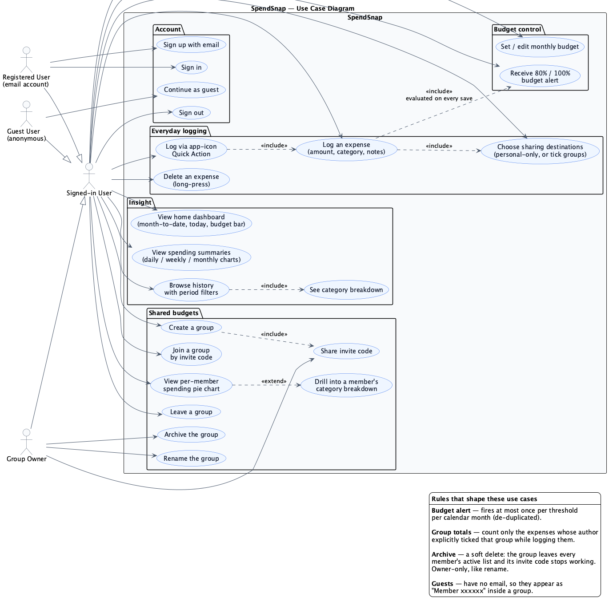

<sub>Source: [`docs/diagrams/07-use-case.puml`](docs/diagrams/07-use-case.puml) · [SVG](docs/diagrams/svg/07-use-case.svg)</sub>

---

## 3. Features

### Implemented

- **Accounts** — sign up with email, sign in again later, or enter as a guest for a quick trial.
- **Manual expense logging** — enter amount, category, notes, date, and optional shared destinations, then review before saving.
- **AI Quick Log** — type a sentence such as `Lunch at McDonald's $12.80`; SpendSnap fills the same editable form and never saves automatically.
- **Editable history** — filter expenses by period, inspect category totals, edit an entry in the existing form, or delete it with an explicit action or long press.
- **Home dashboard** — see this month's total, today's spend, transaction count, budget progress, and recent expenses at a glance.
- **Personal budget controls** — set the monthly limit plus separate warning and exceeded percentages from Home or Summary. Saving recalculates immediately.
- **Non-repeating alerts** — receive at most one warning and one exceeded alert for the configured thresholds in each calendar month.
- **Spending summaries** — compare daily, weekly, and monthly totals, averages, and peaks.
- **Shared groups** — create or join multiple groups, choose which expenses appear in each, and explore member/category breakdowns while retaining a personal history.
- **Quick app entry** — in a native build, long-press the SpendSnap icon to jump directly to expense entry; Expo Go users use the Add Expense tab.

### Planned / placeholder

- **Automatic SMS capture** — intentionally deferred because background message access is platform-sensitive. Quick Log provides the cross-platform, Expo Go-compatible AI entry path.
- **Multi-expense Quick Log** — deferred because independently reviewing, editing, discarding, and saving several drafts needs a dedicated multi-card review experience.

---

## 4. Screenshots / Demo

### AI Quick Log

The flow worth showing first: describe a purchase in one line, and the `parseExpenseText` Cloud Function fills the form in for review. Nothing is written until you confirm.

| Describe the purchase | Review the pre-filled draft |
| --- | --- |
| 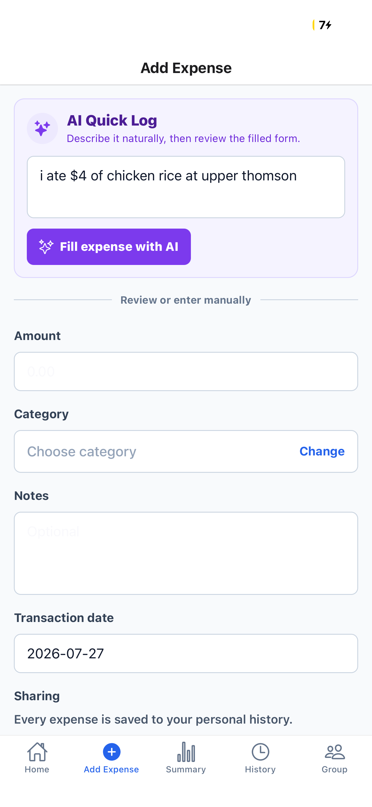 | 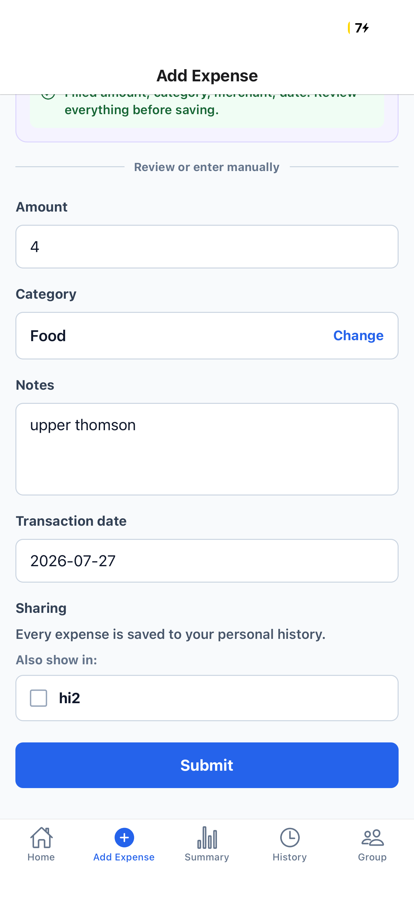 |

<sub>"i ate $4 of chicken rice at upper thomson" becomes amount **4**, category **Food**, merchant **upper thomson** in the notes, and the transaction date — every field still editable before you submit.</sub>

### Edit an expense

Open History, tap **Edit** on the entry that needs correcting, then review the pre-filled form and save the changes. SpendSnap updates the existing entry instead of creating a duplicate.

| Choose an expense from History | Update the existing expense |
| --- | --- |
| 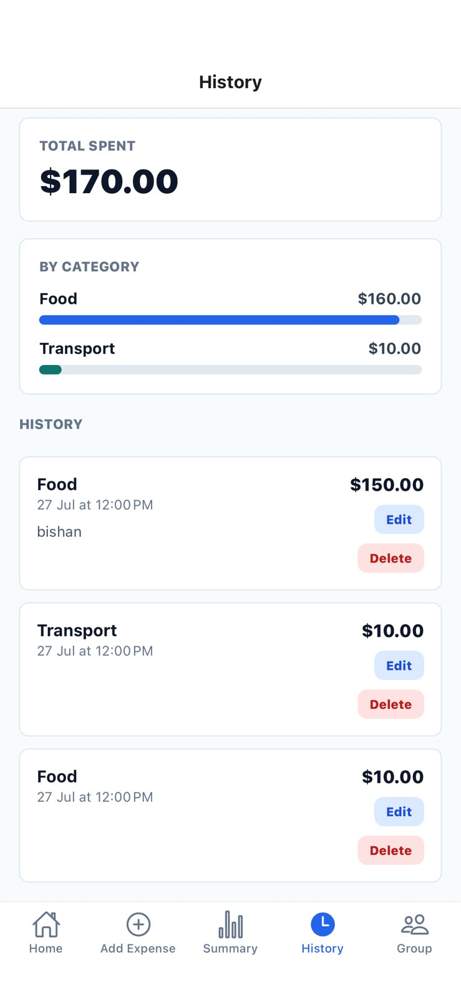 | 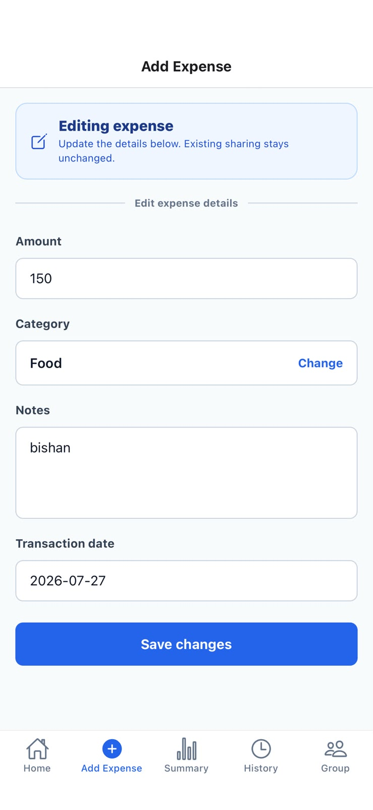 |

<sub>The expense keeps its original identity and sharing destinations; only the reviewed details are updated.</sub>

### Adjust budget alerts

The Summary screen shows current progress against the monthly budget. Tap **Edit** to change the budget amount and choose separate warning and exceeded percentages; saving recalculates the status immediately.

| Review current budget progress | Choose alert percentages |
| --- | --- |
| 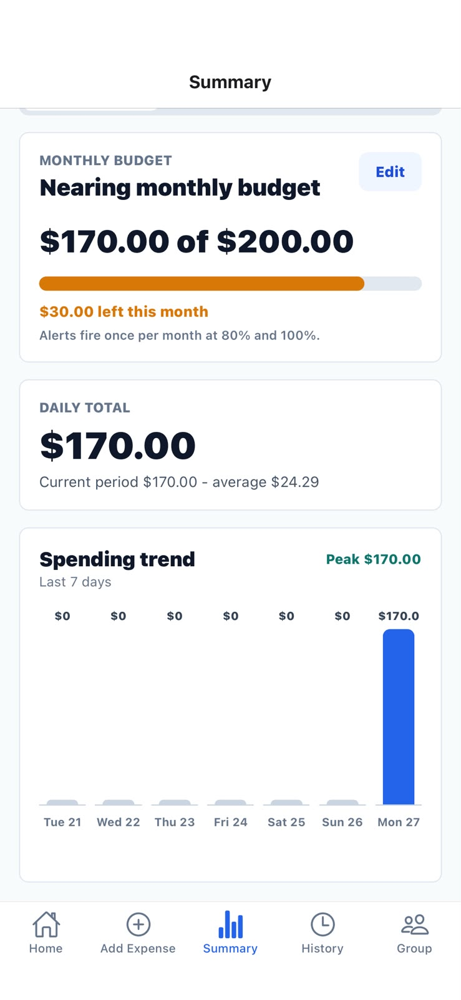 | 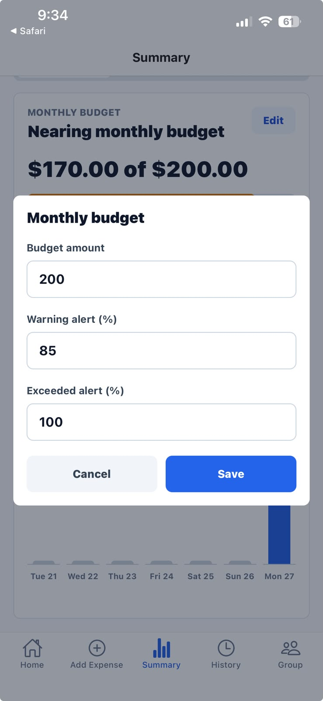 |

<sub>Each configured threshold can notify at most once per calendar month, preventing repeated alerts for the same crossing.</sub>

### Core screens

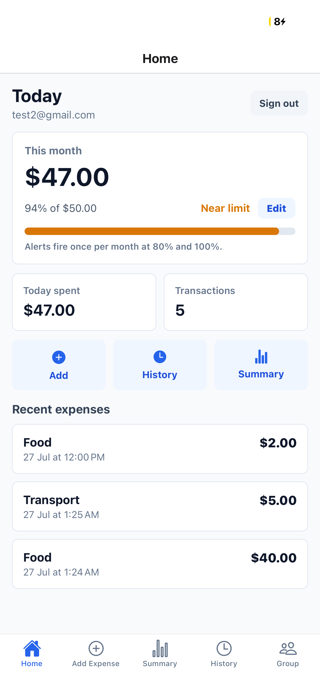

<sub>**Home** — month-to-date total, today's spend, the budget progress bar, and the three most recent expenses.</sub>

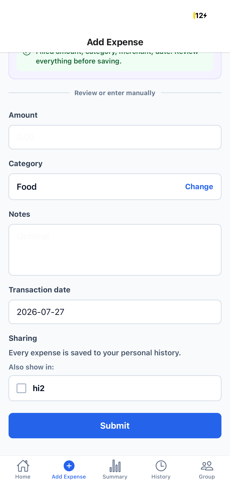

<sub>**Add Expense** — the form itself: amount, category, notes, an editable transaction date, and the "Also show in" tickboxes that decide whether the expense stays personal or joins a shared budget. Every field is editable whether you typed it or Quick Log filled it.</sub>

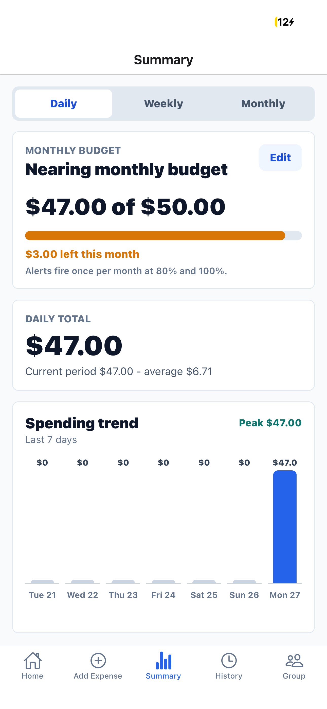

<sub>**Summary** — the Daily tab: the monthly budget card (here at 94%, "Nearing monthly budget") above a last-7-days trend chart with current period, average and peak. Weekly and Monthly tabs show the same shape over 6 weeks / 6 months.</sub>

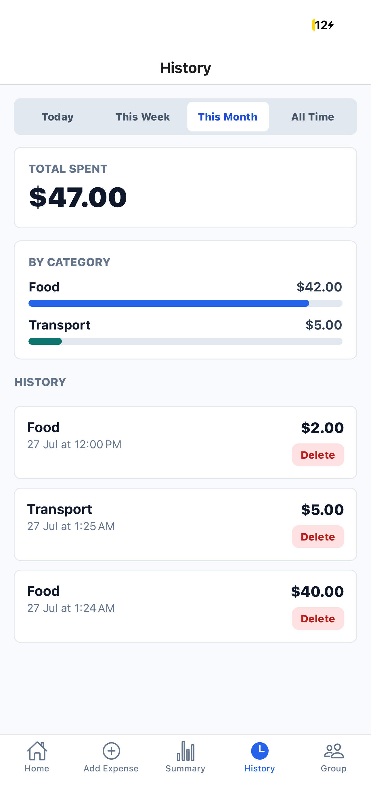

<sub>**History** — Today / This Week / This Month / All Time filters and the category breakdown.</sub>

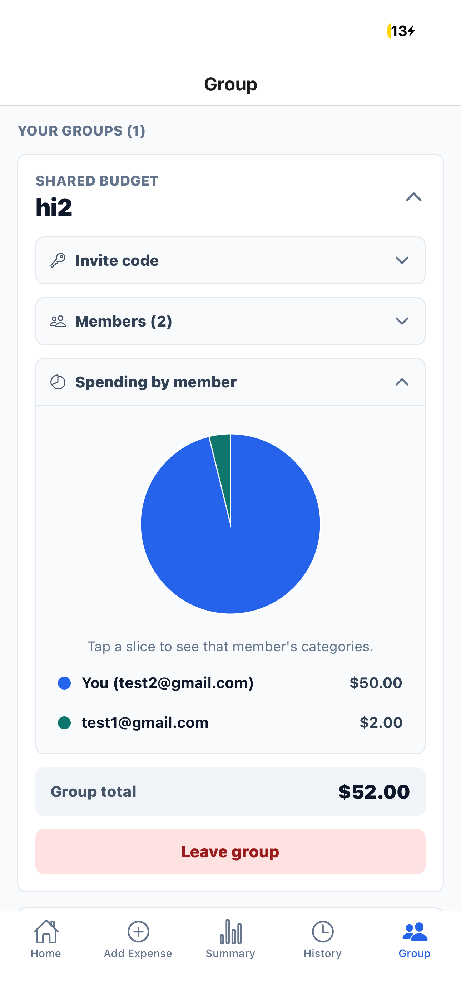

<sub>**Shared budget** — an expanded group card: collapsible invite-code and member sections, the per-member pie chart labelled by email, and the running group total. Tap a slice for that member's category breakdown. The group's owner also sees rename and archive controls here.</sub>

### Capturing them

Run the app (see [Running Locally](#13-usage--running-locally)), then:

- **iOS Simulator** — `⌘S`, or `xcrun simctl io booted screenshot docs/screenshots/home.png`.
- **Android Emulator** — the camera button in the toolbar, or `adb exec-out screencap -p > docs/screenshots/home.png`.
- **Physical device** — the usual hardware shortcut, then AirDrop / copy the file across.

A short GIF of the Quick Log round trip (typing → parsed form) is the single most convincing artefact for a demo or poster; `xcrun simctl io booted recordVideo` captures the video, and any converter turns it into a GIF.

There is no hosted web demo. SpendSnap is a native mobile app; the fastest way to try it is via **Expo Go** with a QR code (see below).

---

## 5. Tech Stack

### Languages & runtime

- **JavaScript (ES2020+)** with JSX.
- **Node.js ≥ 20 (LTS)** for tooling.

### Front end

| Concern | Choice |
| --- | --- |
| UI framework | **React 19.1** + **React Native 0.81.5** |
| Tooling / runtime | **Expo SDK ~54** (managed workflow) |
| Navigation | **@react-navigation/native** + **@react-navigation/bottom-tabs** v7 |
| Icons | **@expo/vector-icons** (Ionicons) |
| Charts | **react-native-svg** (hand-built `PieChart`); bar charts use plain RN views |
| Local persistence | **@react-native-async-storage/async-storage** (auth token persistence) |
| Notifications | **expo-notifications** (local budget alerts) |
| App-icon shortcuts | **expo-quick-actions** |

### Backend (Backend-as-a-Service)

| Concern | Choice |
| --- | --- |
| Authentication | **Firebase Authentication** (`@firebase/auth`) |
| Database | **Cloud Firestore** (`@firebase/firestore`) — document store with real-time listeners |
| Authorization | **Firestore Security Rules** (server-enforced) |
| Server-side logic | **Cloud Functions for Firebase** (Node 20, `asia-southeast1`) — one callable, `parseExpenseText` |
| AI parsing | **OpenAI Responses API** with a strict `json_schema`, called only from the function |
| Secrets | **Secret Manager** via `defineSecret` — the OpenAI key never reaches the client |
| SDK | **firebase** v10.14 |

### Testing & quality

| Concern | Choice |
| --- | --- |
| Unit/component runner | **Jest 29** with the **jest-expo 54** preset |
| Component testing | **@testing-library/react-native 13** + **react-test-renderer 19** |
| System / rules testing | **@firebase/rules-unit-testing 3** against the **Firestore Emulator**, driven by Node's built-in **`node:test`** runner |
| Transpilation | **Babel** via **babel-preset-expo** |

---

## 6. Software Architecture

This section is the heart of the document. SpendSnap is deliberately built to showcase two complementary architectural ideas: a **client–server architecture** in which Firebase supplies the backend tier, and a **component-based, layered front end** that maximises reuse, encapsulation, and testability.

### 6.1 High-level: Client–Server with a BaaS backend

SpendSnap follows a classic **client–server** model. The mobile app is the client; **Firebase acts as the server tier** (a managed *Backend-as-a-Service*, or BaaS). There is no bespoke application server to write, deploy, or scale — Firebase provides authentication, a real-time database, and a server-side authorization engine out of the box.

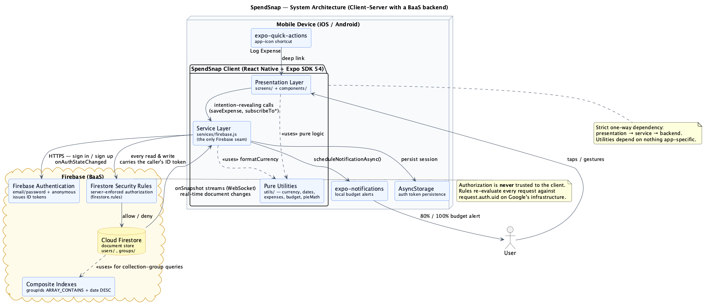

<sub>Source: [`docs/diagrams/01-system-architecture.puml`](docs/diagrams/01-system-architecture.puml) · [SVG](docs/diagrams/svg/01-system-architecture.svg)</sub>

The boundary between client and server is crisp:

- The client **never trusts itself** for authorization. Every read and write is re-evaluated server-side against the security rules using the caller's authenticated identity. Even though the client code "knows" a user should only see their own expenses, the *server* is what guarantees it.
- The client receives **live updates** rather than polling. Firestore's `onSnapshot` opens a streaming subscription; when any device writes, every subscribed device is pushed the change.

### 6.2 Why a Backend-as-a-Service (Firebase) instead of a custom server

Choosing Firebase over a hand-rolled Node/Express + database server was a deliberate engineering trade-off:

**Advantages that we exploit**

- **Less undifferentiated code.** Auth, persistence, real-time sync, and offline caching are solved problems; we don't reimplement them. This keeps the codebase focused on product logic.
- **Real-time by default.** Shared groups and live dashboards "just work" because Firestore pushes changes. Building equivalent WebSocket infrastructure on a custom server is significant effort.
- **Server-enforced authorization without a server process.** Security Rules run on Google's infrastructure on every request. They are declarative, versioned, and testable (we test them — see [§14](#14-testing)).
- **Horizontal scale and availability** are handled by the platform.

**Costs / constraints we accept and design around**

- **Data modelling must suit the query engine.** Firestore has no joins and limited query composition. This directly shaped our expense model (see [§6.7](#67-key-design-decisions-and-trade-offs) and [§7](#7-data-model)).
- **Secrets can't live in the client.** Anything sensitive (e.g. the OpenAI key for SMS parsing) must sit behind a server function — hence that feature is a placeholder rather than a client call.
- **Vendor coupling.** The service layer (`services/firebase.js`) is intentionally the *single* module that imports the Firebase SDK, so this coupling is contained to one file and could be swapped behind the same function signatures.

### 6.3 Layered architecture of the client

The client is split into layers with a strict, one-directional dependency rule: **presentation → service → backend**, and **everything may depend on pure utilities**, but utilities depend on nothing app-specific.

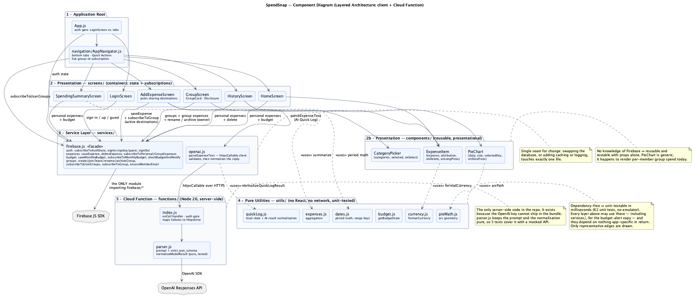

<sub>Every arrow above corresponds to an actual import in the codebase. Source: [`docs/diagrams/02-component-diagram.puml`](docs/diagrams/02-component-diagram.puml) · [SVG](docs/diagrams/svg/02-component-diagram.svg)</sub>

**Why this matters**

- **Encapsulation of the backend.** Screens call `subscribeToPersonalExpenses(uid, onData, onError)` — they have no idea it's a Firestore `collection().orderBy()` query under the hood. The query shape, the field names, and even the database vendor are hidden behind a function name that states *intent*.
- **Testability through isolation.** Because business logic (date bucketing, budget status, currency formatting, pie geometry) lives in `utils/` with **no React or network dependencies**, it can be unit-tested in milliseconds with plain Jest — no emulator, no rendering. Conversely, screens can be tested by **mocking the service layer**, so component tests never touch the network.
- **A single seam for change.** Want to add caching, swap databases, or add logging to every backend call? There is exactly one file to change.

### 6.4 Component-based architecture of the React Native front end

The UI is built from **composable, encapsulated components**. React Native's component model is the front-end analogue of good object-oriented design: each component owns its markup, styling, and behaviour, exposes a typed-by-convention `props` interface, and can be reused or tested in isolation.

We distinguish two kinds of components:

- **Reusable presentational components** (`src/components/`): `ExpenseItem`, `PieChart`, `CategoryPicker`. These are "dumb" — they receive data and callbacks via props and render UI. They hold little or no state and have **no knowledge of Firebase**. This is what makes them reusable and trivially testable.
- **Screen ("container") components** (`src/screens/`): `HomeScreen`, `AddExpenseScreen`, `SpendingSummaryScreen`, `HistoryScreen`, `GroupScreen`, `LoginScreen`. These *compose* presentational components, own screen-level state, wire up subscriptions through the service layer, and orchestrate navigation.

```
GroupScreen  (container)
  ├── manages: list of groups, create/join/leave handlers
  ├── GroupCard  (per-group, manages expand state + per-group subscription)
  │     ├── Disclosure  (reusable collapsible section)
  │     │     ├── Invite code
  │     │     ├── Members (by email)
  │     │     └── PieChart  ← reused presentational component
  │     └── category drilldown
  └── create / join forms
```

**Concrete benefits realised in this codebase**

- **Reuse.** `PieChart` is a generic `{ data, size, selectedKey, onSlicePress }` component. It currently powers per-member group spending, but nothing about it is group-specific — it could render category or time breakdowns unchanged. `ExpenseItem` is reused by both the Home dashboard and the History list.
- **Encapsulation.** `PieChart` hides all SVG arc math behind a clean prop interface; callers never compute angles. That math itself was extracted to `utils/pieMath.js` so the geometry can be verified independently of rendering.
- **Easier testing.** Because `ExpenseItem` is presentational, its test simply renders it with props and asserts on the output — no mocks required. Because `PieChart` takes an `onSlicePress` callback, the test fires a press and asserts the callback receives the right slice key. Encapsulated, prop-driven components are exactly what makes this kind of focused testing possible.
- **Separation of concerns.** A screen decides *what* data to show and *when* to subscribe; a component decides *how* to render it. Changing the look of an expense row never risks breaking a Firestore query.

### 6.5 Data flow and the real-time subscription model

SpendSnap uses **unidirectional data flow** with a reactive twist: data enters a screen through a Firestore subscription, lands in React state, and flows down into components as props.

```
Firestore  ──onSnapshot──▶  service callback  ──setState──▶  screen state
                                                                  │ props
                                                                  ▼
                                                          presentational components
```

A representative pattern (every data-driven screen follows it):

```js
useEffect(() => {
  // The service layer hides the query; the screen only states intent.
  const unsubscribe = subscribeToPersonalExpenses(
    user.uid,
    (items) => { setExpenses(items); setLoading(false); },
    (error)  => { console.warn(error); setLoading(false); }
  );
  return unsubscribe;        // cleanup tears the listener down on unmount
}, [user.uid]);
```

The full round trip — including the budget-alert side effect and the push to other group
members' devices — is traced below.

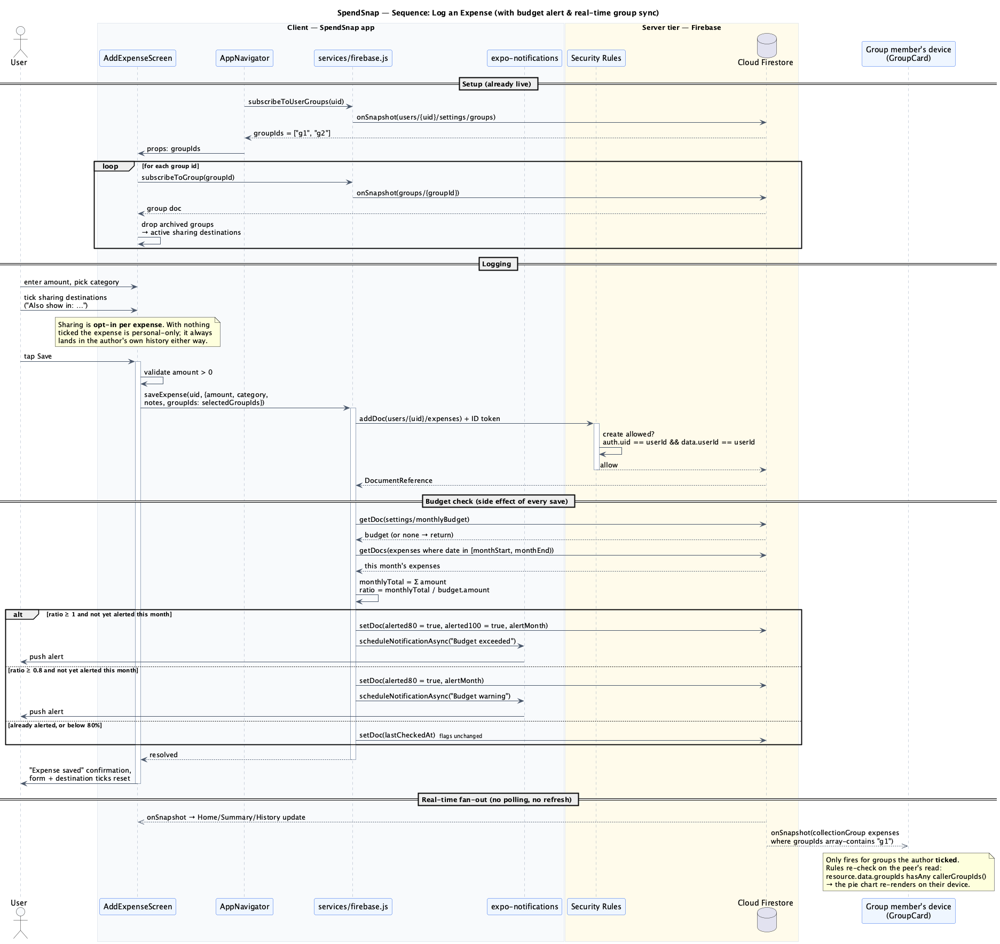

<sub>Source: [`docs/diagrams/04-sequence-add-expense.puml`](docs/diagrams/04-sequence-add-expense.puml) · [SVG](docs/diagrams/svg/04-sequence-add-expense.svg)</sub>

Notable properties:

- **No manual refresh.** When any member of a group logs an expense, the group's `onSnapshot` fires on every other member's device and the pie chart re-renders.
- **Derived state is memoised and pure.** Screens compute summaries with `useMemo` over **pure functions** from `utils/` (e.g. `summarizeExpenses`, `summarizeByCategory`, `getBudgetState`). The same functions are unit-tested directly.
- **Subscriptions are always cleaned up.** Every `useEffect` returns the Firestore `unsubscribe` handle, preventing listener leaks across navigation.
- **App-wide auth gate.** `App.js` subscribes to `subscribeToAuthState`; an unauthenticated user sees `LoginScreen`, an authenticated one sees the tab navigator. This is the top-level state machine of the app.

### 6.6 The security rules as the server-side authorization tier

In a traditional three-tier app, the **server** enforces "who may read/write what." With a BaaS, that responsibility moves into **Firestore Security Rules** — declarative, version-controlled code (`firestore.rules`) that Firebase evaluates **server-side on every operation**. This is genuinely part of our application's logic, not a deployment afterthought.

Highlights of the authorization model (full reference in [§9](#9-security-rules-reference)):

- A user can read/write **only their own** expenses and settings (`request.auth.uid == userId`).
- **Group members can read each other's group-tagged expenses** via a collection-group query. The rule authorises this with a set-intersection check, `resource.data.groupIds.hasAny(callerGroupIds())`, where `callerGroupIds()` looks up the caller's own membership document. No per-document `get()` of the group is needed, which keeps list queries efficient.
- **Joining by invite code is a "self-join only" operation.** The `isSelfJoin` helper uses a direction-independent `diff().affectedKeys()` check so that a caller can only add *their own* membership key and cannot hijack ownership or add others.
- Groups are **joined by known id**, never discovered — `list` on the `groups` collection is denied.

The invite-code join is the most interesting case, because the *same* write is allowed or
denied depending on what it changes:

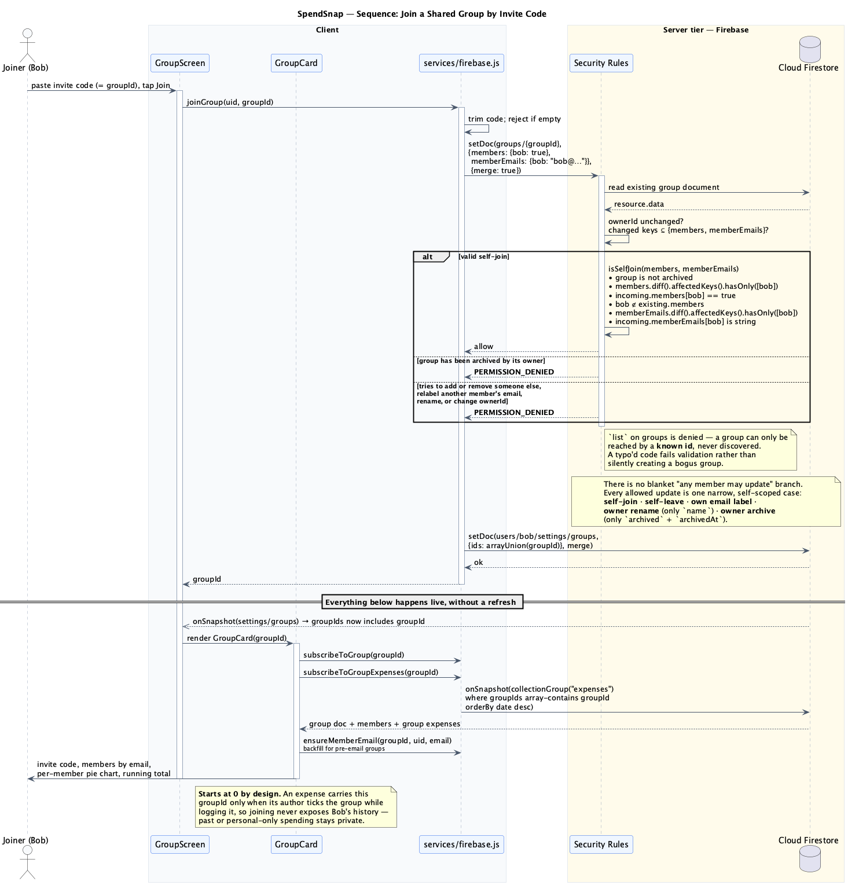

<sub>Source: [`docs/diagrams/05-sequence-join-group.puml`](docs/diagrams/05-sequence-join-group.puml) · [SVG](docs/diagrams/svg/05-sequence-join-group.svg)</sub>

Because these rules *are* logic, they are tested like logic: the [system test suite](#14-testing) spins up the Firestore Emulator and asserts both the allowed and denied paths.

### 6.7 Key design decisions and trade-offs

**1. Personal views are physically separate from group views.**
Home, Summary, and History read the user's **own** `expenses` subcollection (`subscribeToPersonalExpenses`). Group views read a **collection-group** query filtered by `groupIds` (`subscribeToGroupExpenses`). This guarantees that creating, joining, or leaving a group can never make a user's personal history "disappear" — the two pipelines are independent.

**2. An expense is shared to selected groups via a `groupIds` array, tagged at creation.**
Rather than duplicating expense documents per group, each expense carries a `groupIds: string[]`. A group's spending is "every expense whose `groupIds` contains this group id." Users choose whether a new expense is personal-only or shared to one or more active groups. This:
- enables a single indexed `array-contains` query per group, and
- enables the efficient `hasAny` authorization rule.

The deliberate consequence: **a newly created/joined group starts at 0** and only accrues spend logged *afterwards*, because past expenses are not retroactively re-tagged. (Leaving a group *does* strip the tag, so your spend stops counting there.)

**3. Member emails are denormalised onto the group document.**
A client cannot look up another user's email from their UID. So each member's email is stored in `groups/{id}.memberEmails` (which members may already read), and a small backfill keeps older groups current. This is a classic denormalisation-for-read trade-off appropriate to a document database.

**4. Pure logic is extracted from UI.**
Date math, aggregation, budget evaluation, currency formatting, and pie geometry live in `utils/` precisely so they can be unit-tested without a renderer or network — and so screens stay thin.

### 6.8 Design diagrams (index)

All design diagrams are written in **PlantUML** and kept in [`docs/diagrams/`](docs/diagrams), so they are version-controlled next to the code they describe and can be re-rendered deterministically. Rendered `png/` (for this README) and `svg/` (for slides and printing) are committed alongside the sources.

| # | Diagram | Type | Answers |
| --- | --- | --- | --- |
| 1 | [System architecture](docs/diagrams/png/01-system-architecture.png) | Deployment / component | Where the client ends and the Firebase server tier begins ([§6.1](#61-high-level-clientserver-with-a-baas-backend)) |
| 2 | [Component diagram](docs/diagrams/png/02-component-diagram.png) | Component | The layered client and its one-directional dependencies ([§6.3](#63-layered-architecture-of-the-client)) |
| 3 | [Data model](docs/diagrams/png/03-data-model.png) | Class | Firestore document shapes and the `groupIds` mirroring ([§7](#7-data-model)) |
| 4 | [Log an expense](docs/diagrams/png/04-sequence-add-expense.png) | Sequence | Save → budget alert → real-time fan-out ([§6.5](#65-data-flow-and-the-real-time-subscription-model)) |
| 5 | [Join a group](docs/diagrams/png/05-sequence-join-group.png) | Sequence | How the rules permit a self-join and nothing more ([§6.6](#66-the-security-rules-as-the-server-side-authorization-tier)) |
| 6 | [Budget alert evaluation](docs/diagrams/png/06-activity-budget-alert.png) | Activity | `checkBudgetAndNotify()` thresholds and per-month de-duplication |
| 7 | [Use cases](docs/diagrams/png/07-use-case.png) | Use case | Actors and the features they reach ([§2](#2-problem-motivation)) |
| 8 | [Auth gate & navigation](docs/diagrams/png/08-navigation-state.png) | State machine | The top-level app state machine ([§6.5](#65-data-flow-and-the-real-time-subscription-model)) |

The two not embedded elsewhere in this document:

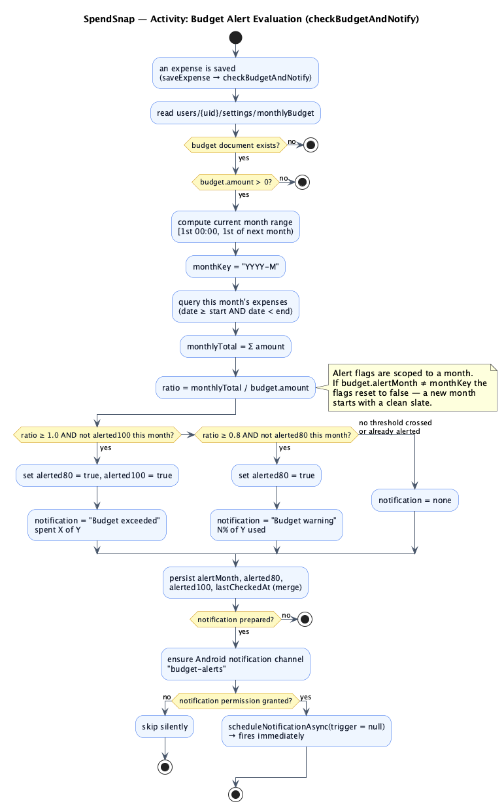

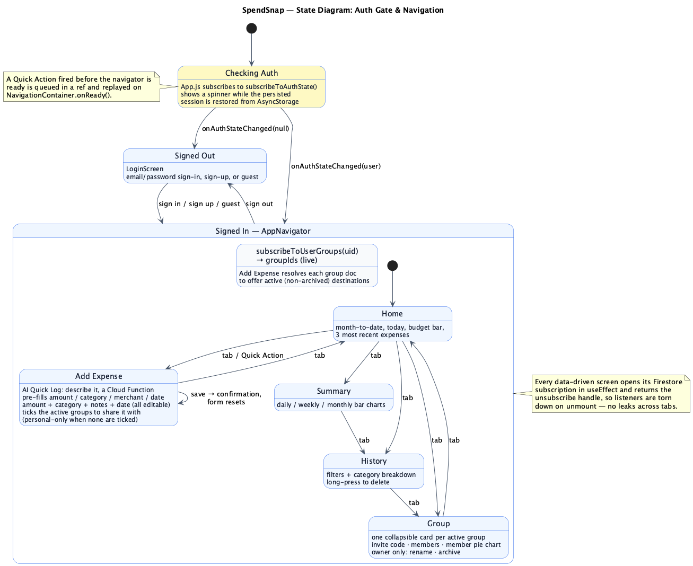

To re-render after editing a `.puml` file:

```bash
cd docs/diagrams
./render.sh                 # all diagrams → png/ and svg/
./render.sh 03-data-model   # just one
```

The script needs a JDK and fetches `plantuml.jar` on first run; Graphviz is optional (see [`docs/diagrams/README.md`](docs/diagrams/README.md)).

---

## 7. Data Model

Firestore is schemaless, but SpendSnap maintains a **consistent, documented document shape**. All application data lives under two top-level collections: `users` and `groups`.

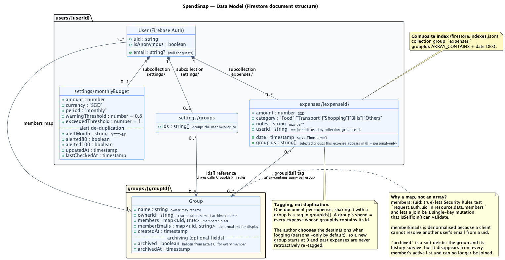

<sub>Source: [`docs/diagrams/03-data-model.puml`](docs/diagrams/03-data-model.puml) · [SVG](docs/diagrams/svg/03-data-model.svg)</sub>

The same structure as a literal document tree:

```
users/{userId}
  ├── expenses/{expenseId}
  │     amount:    number          // in SGD
  │     category:  string          // "Food" | "Transport" | "Shopping" | "Bills" | "Others"
  │     notes:     string          // may be ""
  │     date:      timestamp       // serverTimestamp() at creation
  │     userId:    string          // == {userId}, used by collection-group reads
  │     groupIds:  string[]        // selected groups this expense appears in ([] when personal-only)
  │     updatedAt: timestamp        // added when an existing expense is edited
  │
  └── settings/{settingId}
        monthlyBudget:
          amount:            number
          currency:          "SGD"
          period:            "monthly"
          warningThreshold:  number   // user-selected ratio; default 0.8
          exceededThreshold: number   // user-selected ratio; default 1
          alertMonth:        string   // "YYYY-M" — month the alert flags apply to
          alertedWarning:    boolean  // dedupe flag for the configured warning
          alertedExceeded:   boolean  // dedupe flag for the configured exceeded alert
          alertedWarningThreshold:  number
          alertedExceededThreshold: number
          updatedAt:         timestamp
        groups:
          ids:               string[] // group ids the user currently belongs to

groups/{groupId}
    name:         string
    ownerId:      string                 // creator; can rename/archive/delete
    archived:     boolean                // optional; archived groups are hidden from active UI
    archivedAt:   timestamp              // optional
    members:      { [uid: string]: true } // membership set as a map
    memberEmails: { [uid: string]: string } // denormalised for display
    createdAt:    timestamp
```

**Design notes**

- `members` is a **map (`uid -> true`)**, not an array, so rules can test membership with `request.auth.uid in resource.data.members` and joins can be expressed as single-key map mutations.
- `groupIds` on each expense is the linchpin that lets a **collection-group** query gather a whole group's spending across every member's subcollection.
- A composite index supports the group query (see `firestore.indexes.json`): `expenses` (collection group) on `groupIds ARRAY_CONTAINS` + `date DESC`.

---

## 8. Service & Data API Reference

SpendSnap has no REST API; instead, **`src/services/firebase.js` is the application's internal API** — the contract between the UI and the backend. Every function below is the *only* sanctioned way for the UI to touch Firebase.

### Authentication

| Function | Description |
| --- | --- |
| `subscribeToAuthState(onUser, onError)` | Streams the current Firebase user (or `null`). Returns an unsubscribe fn. |
| `signUpWithEmail(email, password)` | Creates an email/password account. |
| `signInWithEmail(email, password)` | Signs in with email/password. |
| `signInAsGuest()` | Anonymous sign-in. |
| `signOutUser()` | Signs out. |

### Expenses

| Function | Description |
| --- | --- |
| `saveExpense(userId, { amount, category, notes, groupIds, date })` | Adds an expense to the user's subcollection with the reviewed transaction date and supplied `groupIds`. Then runs `checkBudgetAndNotify`. |
| `updateExpense(userId, expenseId, { amount, category, notes, date })` | Updates the existing document in place, preserves its identity and sharing, adds `updatedAt`, then recalculates the budget. |
| `deleteExpense(userId, expenseId)` | Deletes one of the user's expenses. |
| `subscribeToPersonalExpenses(userId, onExpenses, onError)` | Live stream of the user's **own** expenses, newest first. Powers Home, Summary, History. |
| `subscribeToGroupExpenses(groupId, onExpenses, onError)` | Collection-group live stream of **all** expenses tagged with `groupId`. Powers the group pie charts. |

### AI Quick Log

| Function | Description |
| --- | --- |
| `parseExpenseText(description)` | Calls the authenticated `parseExpenseText` Firebase callable function and normalizes its structured result for the review form. |

### Budget & alerts

| Function | Description |
| --- | --- |
| `saveMonthlyBudget(userId, amount, warningThreshold, exceededThreshold)` | Saves the limit and user-selected thresholds, then immediately recalculates alerts against the new settings. |
| `subscribeToMonthlyBudget(userId, onBudget, onError)` | Live stream of the budget document (or `null`). |
| `checkBudgetAndNotify(userId)` | Computes month-to-date spend and fires at most once for each configured threshold in a calendar month. |

### Groups

| Function | Description |
| --- | --- |
| `subscribeToUserGroups(userId, onGroupIds, onError)` | Live stream of the user's group-id list (`settings/groups.ids`). |
| `subscribeToGroup(groupId, onGroup, onError)` | Live stream of a single group document. |
| `createGroup(userId, name)` | Creates a group (caller as owner+member, email captured), adds it to the user's membership list. Does **not** backfill past expenses. |
| `joinGroup(userId, groupId)` | Self-joins an existing group by id and records membership. |
| `leaveGroup(userId, groupId)` | Removes the user from the group and **strips that group id from all their expenses** so their spend stops counting there. |
| `ensureMemberEmail(groupId, userId, email)` | Backfills the caller's email onto a group that predates email tracking. |

**Contract conventions**

- All `subscribe*` functions return an **unsubscribe function** and take `(…, onData, onError)`.
- All mutating functions are **async** and reject on failure (the UI surfaces a friendly message and logs the error).
- `userId` arguments are validated; a missing id throws immediately (`requireUserId`).

---

## 9. Security Rules Reference

The full rules live in [`firestore.rules`](firestore.rules). Summary of intent:

```
groups/{groupId}
  get:    signed-in AND caller ∈ members
  list:   denied (groups are reached by known id, not discovered)
  create: caller is ownerId AND caller ∈ members
  update: ownerId unchanged AND one of:
          - owner renames the group
          - owner archives the group
          - caller self-joins
          - caller self-leaves
          - caller updates only their own email label
  delete: caller is ownerId

users/{userId}/expenses/{expenseId}
  read (own subcollection):   caller == userId
  create:                     caller == userId AND data.userId == userId
  update / delete:            caller == userId

{path=**}/expenses/{expenseId}   (collection-group reads, e.g. group pie charts)
  read:   resource.data.groupIds  hasAny  callerGroupIds()

users/{userId}/settings/{settingId}
  read / write:  caller == userId

everything else:  denied
```

**Helper functions**

- `callerGroupIds()` — reads the caller's `settings/groups.ids` (or `[]`), enabling the `hasAny` set-intersection authorization without a per-document group lookup.
- `isSelfJoin(existing, incoming)` — true only when the **sole** change to `members` is the caller adding their own key (`affectedKeys().hasOnly([uid])`), they set it to `true`, and they weren't already a member. Direction-independent, so it's immune to the classic `addedKeys()`/`removedKeys()` orientation bug.

These rules are validated by the emulator-backed system tests in `system-tests/` — both the **allowed** paths and the **denied** paths are asserted.

---

## 10. Prerequisites

- **Node.js ≥ 20 LTS** (Node 20 or 22 recommended for Expo SDK 54).
- **npm** (bundled with Node).
- **Expo Go** app on a physical iOS/Android device, *or* an iOS Simulator / Android Emulator.
- A **Firebase project** with **Authentication** (Email/Password + Anonymous enabled) and **Cloud Firestore** provisioned.
- A Firebase plan that supports Cloud Functions, plus an **OpenAI API account** for AI Quick Log.
- **firebase-tools** (the Firebase CLI) — required only for deploying rules/indexes and for running the system tests against the emulator. Install with `npm i -g firebase-tools`.
- **JDK 21 or newer** for the Firestore Emulator used by `npm run test:system`. Recent `firebase-tools` versions no longer support older Java runtimes.

---

## 11. Installation

```bash
# 1. Clone
git clone https://github.com/GeraldFSE/SpendSnap.git
cd SpendSnap

# 2. Install dependencies
#    (A peer-dependency mismatch between firebase and async-storage means npm's
#     strict resolver needs the legacy flag.)
npm install --legacy-peer-deps
npm --prefix functions install

# 3. Create your environment file
cp .env.example .env
#    then fill in the values (see Configuration below)
```

There is **no database migration or seeding step** — Firestore is schemaless and collections are created on first write. If you want server-side authorization to match the app, deploy the rules and indexes once:

```bash
# requires firebase-tools and `firebase login`
firebase deploy --only firestore:rules,firestore:indexes
```

---

## 12. Configuration

All configuration is supplied through **Expo public environment variables** (the `EXPO_PUBLIC_` prefix exposes them to the client bundle). Copy `.env.example` to `.env` and fill in:

| Variable | Purpose |
| --- | --- |
| `EXPO_PUBLIC_FIREBASE_API_KEY` | Firebase web API key |
| `EXPO_PUBLIC_FIREBASE_AUTH_DOMAIN` | Firebase auth domain |
| `EXPO_PUBLIC_FIREBASE_PROJECT_ID` | Firebase project id |
| `EXPO_PUBLIC_FIREBASE_STORAGE_BUCKET` | Firebase storage bucket |
| `EXPO_PUBLIC_FIREBASE_MESSAGING_SENDER_ID` | Firebase messaging sender id |
| `EXPO_PUBLIC_FIREBASE_APP_ID` | Firebase app id |
These are read in `src/services/firebase.js` to construct the Firebase config. Project-level app configuration (name, bundle ids, plugins) lives in `app.json`.

> **Security note:** `EXPO_PUBLIC_*` values are embedded in the app bundle and are not secret. Firebase web API keys are designed to be public — your data is protected by **Security Rules**, not by hiding the key. Genuinely secret keys (like OpenAI) must live behind a server.

Configure the OpenAI key as a Firebase Functions secret; never add it to `.env`:

```bash
firebase functions:secrets:set OPENAI_API_KEY
firebase deploy --only functions:parseExpenseText
```

---

## 13. Usage / Running Locally

Start the Metro bundler and open the app in Expo Go:

```bash
npx expo start --go --clear
```

What the flags mean:

- `npx expo start` — boots the Metro bundler and shows a QR code.
- `--go` — targets **Expo Go** directly (rather than a custom dev build).
- `--clear` — clears the Metro cache; use it after changing dependencies, `babel.config.js`, or environment variables to avoid stale-module errors.

Then:

- **Physical device:** scan the QR code with Expo Go (Android) or the Camera app (iOS).
- **Simulator/emulator:** press `i` (iOS) or `a` (Android) in the terminal, or run `npm run ios` / `npm run android`.

Metro serves on port **8081** by default.

> Home Screen Quick Actions require a development or EAS build to exercise fully; in Expo Go, use the **Add Expense** tab for the same flow.

If Expo hangs on start, confirm your Node version is an LTS release (20 or 22).

---

## 14. Testing

SpendSnap ships with **122 automated tests** across four categories, reflecting a deliberate testing pyramid: many fast unit tests, component tests, mocked Cloud Function parser tests, and focused Firestore system tests.

| Suite | Runner | What it covers | Count |
| --- | --- | --- | --- |
| **Unit** | Jest (node) | Pure logic in `utils/`: currency, dates, expenses, budget, pie geometry, Quick Log normalization | 65 |
| **Component** | Jest + RNTL | `ExpenseItem`, `PieChart`, `HomeScreen`, `AddExpenseScreen` (services mocked) | 21 |
| **Function** | `node:test` | OpenAI structured-result normalization using mocked Responses API output | 11 |
| **System** | `node:test` + Firestore Emulator | Security rules and data-model behaviour end-to-end | 25 |

### Commands

```bash
# Unit + component tests (fast; no emulator needed)
npm test
npm run test:watch        # watch mode

# Cloud Function parser tests (OpenAI is mocked; no API usage)
npm run test:functions

# System tests — spins up the Firestore Emulator automatically
npm run test:system

# Everything
npm run test:all
```

### What the system tests assert (examples)

- Non-members cannot read a group; members can.
- Listing all groups is denied; invite-code self-join works; archived groups reject joins; a joiner cannot hijack `ownerId` or add someone else.
- A user can only read/write their own expenses and settings.
- Group members can read each other's group-tagged expenses; outsiders cannot.
- **A newly created group starts at 0** and only counts expenses logged afterwards.
- An expense can be shared into selected groups through its `groupIds` tags.
- Leaving a group removes the member's contributions and email from it.

### Why testing is easy here (architecture pays off)

- **Unit tests** import pure functions directly — no React, no Firebase, no emulator.
- **Component tests** render presentational components with props, or render screens with the **service layer mocked**, so they never hit the network.
- **System tests** exercise the *real* rules and query shapes against an emulator, giving confidence that the server tier behaves as designed.

> Note: the Firestore Emulator requires **JDK 21+**. The first `test:system` run downloads the emulator jar and writes `firestore-debug.log`, which is generated local output and should not be committed. A benign `watchman` recrawl warning may print before Jest runs; it does not affect results.

---

## 15. Project Structure

```
SpendSnap/
├── App.js                       # Root component: auth gate (Login vs. tab navigator)
├── app.json                     # Expo app configuration (name, bundle ids, plugins)
├── babel.config.js              # Babel (babel-preset-expo)
├── jest.config.js               # Jest config (jest-expo preset) for unit/component tests
├── firebase.json                # Firebase CLI config (rules + indexes paths)
├── .firebaserc                  # Default Firebase project
├── firestore.rules              # Server-side authorization (the backend "logic" tier)
├── firestore.indexes.json       # Composite index for the group collection-group query
├── .env.example                 # Template for required environment variables
│
├── docs/
│   ├── diagrams/                # PlantUML design diagrams (see §6.8)
│   │   ├── *.puml               # Sources — the diagrams of record
│   │   ├── png/                 # Rendered for the README
│   │   ├── svg/                 # Rendered for slides/printing
│   │   └── render.sh            # Regenerates png/ and svg/
│   └── screenshots/             # App captures embedded in §4
│
├── src/
│   ├── navigation/
│   │   └── AppNavigator.js       # Bottom-tab navigator; subscribes to the user's groups;
│   │                             #   wires Quick Actions and tab icons
│   ├── screens/                  # Container components (state + subscriptions + composition)
│   │   ├── LoginScreen.js
│   │   ├── HomeScreen.js
│   │   ├── AddExpenseScreen.js
│   │   ├── SpendingSummaryScreen.js
│   │   ├── HistoryScreen.js
│   │   └── GroupScreen.js
│   ├── components/               # Reusable presentational components
│   │   ├── ExpenseItem.js
│   │   ├── PieChart.js           # interactive SVG pie (delegates math to utils/pieMath)
│   │   └── CategoryPicker.js
│   ├── services/                 # The only modules that talk to external services
│   │   ├── firebase.js           # Firebase init + the app's internal data API
│   │   └── openai.js             # authenticated AI Quick Log callable client
│   ├── utils/                    # Pure, dependency-free logic (unit-tested)
│   │   ├── currency.js           # SGD formatting
│   │   ├── dates.js              # timestamp coercion, period math, range keys
│   │   ├── expenses.js           # aggregation: by category, by period, current month
│   │   ├── budget.js             # budget status/colour/detail derivation
│   │   └── pieMath.js            # SVG arc geometry + slice computation
│   └── **/__tests__/             # Co-located unit & component tests
│
├── functions/
│   ├── src/index.js               # authenticated Firebase callable + secret binding
│   ├── src/parser.js              # OpenAI structured extraction + normalization
│   └── test/parser.test.js        # mocked OpenAI parser tests
│
└── system-tests/
    └── firestore.test.mjs        # Emulator-backed security-rule & data-model tests
```

This layout makes the architecture legible at a glance: `services/` is the backend seam, `utils/` is pure logic, `components/` is reusable UI, and `screens/` composes them.

---

## 16. Deployment

SpendSnap is a client app plus Firebase configuration; "deployment" has two independent parts.

### 1. The backend configuration (rules, indexes, and Quick Log)

```bash
firebase deploy --only firestore:rules,firestore:indexes
firebase functions:secrets:set OPENAI_API_KEY
firebase deploy --only functions:parseExpenseText
```

This publishes the authorization rules and the composite index to your Firebase project. **Deploy rules whenever they change** — the app's group queries will fail with `permission-denied` until the matching rules are live.

### 2. The mobile client (Expo Application Services)

The project is EAS-ready (`app.json` includes an `eas.projectId`). Typical flow:

```bash
npm i -g eas-cli
eas login
eas build --platform ios      # or android, or: --platform all
eas submit                    # to the App Store / Play Store
```

For team testing without store submission, distribute a **development build** or use Expo Go with the published QR/URL.

### CI/CD

There is no CI pipeline committed yet. A natural setup (see [Roadmap](#17-roadmap--known-limitations)) is a GitHub Actions workflow that runs `npm test` on every PR and `npm run test:system` (with the emulator) on protected branches, then triggers `eas build` on release tags.

---

## 17. Roadmap & Known Limitations

### Roadmap

- **Optional message/screenshot ingestion** feeding the existing AI Quick Log parser, after platform permissions and privacy are validated.
- **CSV / data export** of expenses and summaries.
- **Recurring expenses** and per-category budgets.
- **CI pipeline** (lint + unit/component + emulator system tests on every PR).
- **Richer group analytics** (per-period group trends, settle-up suggestions).
- **Type safety** via a gradual migration to TypeScript.

### Known limitations

- **Groups start at 0 by design.** Past expenses are not back-tagged when you create/join a group; only subsequently logged expenses count.
- **Member labels depend on email being captured.** Members who joined before email tracking (or via anonymous accounts) appear as `Member xxxxxx` until they next open the group (which backfills their email) — anonymous users have no email at all.
- **Quick Actions need a native build.** They are inert in Expo Go.
- **No license file yet** (see below).
- **Single currency (SGD).** Multi-currency is not implemented.

---

## 18. Contributing

Contributions are welcome. Suggested workflow (consistent with the repo's existing `feature/*` branch history):

1. **Branch** off `main` using a descriptive prefix: `feature/…`, `fix/…`, or `chore/…`.
2. **Keep the layering intact.** New backend access goes through `services/firebase.js`; new pure logic goes in `utils/` (and gets a unit test); UI goes in `components/` (reusable) or `screens/` (composition).
3. **Add tests.** Pure logic → a `utils/__tests__` unit test. Rule/data-model changes → a case in `system-tests/`. Components → an RNTL test with the service mocked.
4. **Run the suite** before pushing:
   ```bash
   npm run test:all
   ```
5. **Open a PR** against `main` with a clear description and screenshots for UI changes.

### Code style

- Match the surrounding style: 2-space indentation, descriptive function names that state intent, comments that explain *why* (not *what*).
- Prefer extracting non-trivial logic into a pure `utils/` function over inlining it in a component — it keeps screens thin and makes the logic testable.

*(A dedicated `CONTRIBUTING.md` is not yet present; these guidelines serve in the interim.)*

---

## 19. License

No `LICENSE` file is currently included in the repository, so **all rights are reserved by default** and the project is effectively unlicensed for reuse. This reflects its origin as an academic project (NUS Orbital).

If you intend to open-source it, add a `LICENSE` file (MIT is a common permissive choice) and update this section accordingly.

---

## 20. Acknowledgments & Contact

**Project team:** *404: Hackers Not Found* — Apollo 11, **NUS Orbital 2026**.
**Authors:** Gabriel and Gerald.

**Repository:** <https://github.com/GeraldFSE/SpendSnap>

Built with [Expo](https://expo.dev), [React Native](https://reactnative.dev), and [Firebase](https://firebase.google.com). Charts rendered with [react-native-svg](https://github.com/software-mansion/react-native-svg); icons from [Ionicons](https://ionic.io/ionicons) via [@expo/vector-icons](https://github.com/expo/vector-icons).

For questions or support, open an issue on the GitHub repository.
